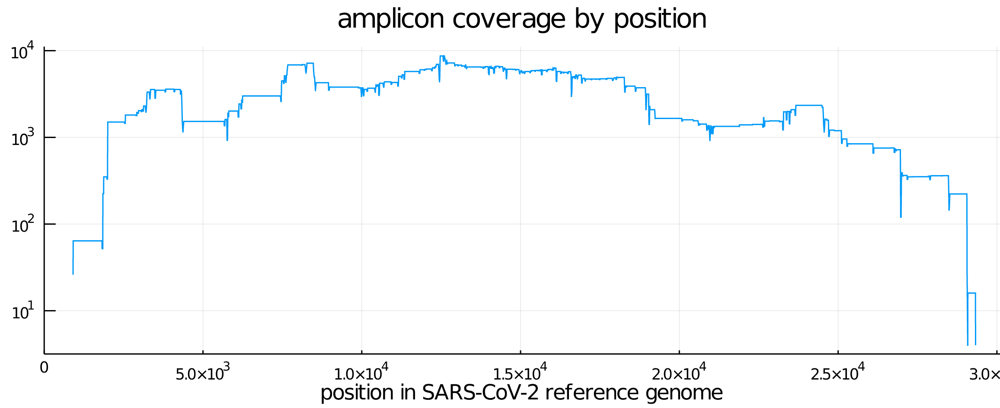

# sars-cov-2-mutation-fingerprints

Datasets and tables for the publication "[Profiling SARS-CoV-2 mutation fingerprints that range from the viral pangenome to individual infection quasispecies](https://www.medrxiv.org/content/10.1101/2020.11.02.20224816v1)" by Billy T. Lau, Dmitri S. Pavlichin, Anna C. Hooker, Alison Almeda, Giwon Shin, Jiamin Chen, Malaya K. Sahoo, ChunHong Huang, Benjamin A. Pinsky, HoJoon Lee, and Hanlee P. Ji.

This repository hosts some of the smaller objects and result tables (cloning it takes about 60MB), while the larger objects are stored in an AWS S3 bucket, with download links provided below. Please see the draft for a description of the datasets involved and the results computed.

* [Data sources](#Data-sources)
  * [SARS-CoV-2 genomes](#Sars-cov-2-genomes)
    * [Reference genome from GISAID](#Reference-genome-from-gisaid)
    * [4K genomes](#4k-dataset)
    * [75K genomes](#75k-dataset)
  * [non-SARS-CoV-2 genomes](#Non-sars-cov-2-genomes)
    * [Reference human genome GRCh38](#Reference-human-genome-grch38)
    * [89 bacterial genomes](#89-bacterial-genomes)
    * [42 influenza genomes](#42-influenza-genomes)
    * [447 other human coronavirus genomes](#447-other-human-coronavirus-genomes)
    * [321 other human virus genomes](#321-other-human-virus-genomes)
* [Results](#Results)
  * [Candidate primer pairs (CSV)](#Candidate-primer-pairs)
  * [k-mer counts for 4K SARS-CoV-2 genomes](#k-mer-counts-for-all-sars-cov-2-genomes)
    * [All distinct 25-mers (CSV)](#Alphabetical-list-of-all-distinct-25-mers-in-the-4k-genome-dataset)
    * [Genome ids (CSV)](#List-of-all-genome-ids-in-the-4k-genome-dataset)
    * [Matrix of 25-mer counts, by genome and by k-mer (binary uint8 element type)](#Matrix-of-25-mer-counts-in-each-genome-in-the-4k-genome-dataset)
    * [All 25-mers in the reference genome (BED)](#List-of-25-mers-in-the-reference-genome)
    * [Unique, conserved 25-mers (BED)](#List-of-unique-conserved-25-mers)
    * [Unique, conserved, and specific 25-mers (BED)](#List-of-unique-conserved-specific-25-mers)

## Data sources

A set of 3,968 ("4K") genomes was downloaded from [GISAID](https://www.gisaid.org/) on April 9th, 2020 -- the most recent available at the time we constructed candidate primer pairs. A larger set of 75,681 genomes ("75K") downloaded from GISAID on September 23rd, 2020, was later used for computational analysis of the SARS-CoV-2 mutation landscape. These datasets are available as FASTA files with one line per sequence, and where each non-ACGT character was replaced by 'N'. Some GISAID sequences included multiple white space characters within one line, which were removed to produce this file.

### SARS-CoV-2 genomes

#### Reference genome from GISAID

[`genomes/sars-cov-2/sars-cov-2_reference_EPI_ISL_402124.fa.gz`](https://raw.github.com/dmitrip/sars-cov-2-mutation-fingerprints/master/genomes/sars-cov-2/sars-cov-2_reference_EPI_ISL_402124.fa.gz) (8.8KB gzipped, 30KB compressed)

#### 4K dataset
3,968 genomes downloaded from GISAID on April 9th, 2020

[`genomes/sars-cov-2/sars-cov-2_4K_2020-4-9.fa.gz`](https://raw.github.com/dmitrip/sars-cov-2-mutation-fingerprints/master/genomes/sars-cov-2/sars-cov-2_4K_2020-4-9.fa.gz) (15MB gzipped, 114MB uncompressed)

#### 75K dataset
75,681 genomes from GISAID as of September 23rd, 2020

[`sars-cov-2_75K_2020-9-23.fa.gz`](https://sars-cov-2-mutation-fingerprints.s3.amazonaws.com/sars-cov-2_75K-2020-9-23.fa.gz) (270MB gzipped, 2.2GB uncompressed)

This file is too large to host here, so we put it in an AWS S3 bucket and provide the download link above.

### Non-SARS-CoV-2 genomes

These genomes are used as the off-target dataset: a primer (25-mer) is "not specific" to SARS-CoV-2 if it occurs in any of the below viral or bacterial genomes with up to 4 basepair mismatches, or in the human reference genome GRCh38 with up to 2 basepair mismatches.  At most one member of a candidate primer pair may be non-specific to SARS-CoV-2.

All FASTA files (except GRCh38) have 

#### Reference human genome GRCh38

Hosted by UCSC: [link](https://hgdownload.cse.ucsc.edu/goldenpath/hg38/chromosomes/).

#### 89 bacterial genomes

Listed by the FDA.

[`genomes/non-sars-cov-2/fda-bacteria.fa.gz`](https://raw.github.com/dmitrip/sars-cov-2-mutation-fingerprints/master/genomes/non-sars-cov-2/fda-bacteria.fa.gz) (14MB gzipped, 49MB uncompressed)

#### 42 influenza genomes

[`genomes/non-sars-cov-2/influenza.fa.gz`](https://raw.github.com/dmitrip/sars-cov-2-mutation-fingerprints/master/genomes/non-sars-cov-2/influenza.fa.gz) (22KB gzipped, 75KB uncompressed)

#### 447 other human coronavirus genomes

[`genomes/non-sars-cov-2/other-human-coronavirus.fa.gz`](https://raw.github.com/dmitrip/sars-cov-2-mutation-fingerprints/master/genomes/non-sars-cov-2/other-human-coronavirus.fa.gz) (2.2MB gzipped, 13MB uncompressed)

#### 321 other human virus genomes

[`genomes/non-sars-cov-2/other-human-virus.fa.gz`](https://raw.github.com/dmitrip/sars-cov-2-mutation-fingerprints/master/genomes/non-sars-cov-2/other-human-virus.fa.gz) (1.1MB gzipped, 3.7MB uncompressed)

## Results

Below we describe the tables we generated and used in our publication.

### Candidate primer pairs

[`primer_pairs/candidate-primer-pairs_2020-4-9.csv.gz`](https://raw.github.com/dmitrip/sars-cov-2-mutation-fingerprints/master/primer_pairs/candidate-primer-pairs_2020-4-9.csv.gz) (1.3MB gzipped, 9.4MB uncompressed)

A csv file of the 88,612 candidate primer pairs we generated based on the 4K GISAID SARS-CoV-2 genome dataset.  All coordinates are 1-based and given with respect to the SARS-CoV-2 reference genome.

|#|field name|description
|-|:-|:-
|1|`forward (5' to 3')`|forward primer (printed from left to right)
|2|`reverse (5' to 3')`|reverse primer (printed from right to left with reverse complement)
|3|`forward strand`|always `+`
|4|`reverse strand`|always `-`
|5|`forward start`|start of forward primer (in reference genome, 1-based)
|6|`forward stop`|stop of forward primer (in reference genome, 1-based)
|7|`reverse start`|start of reverse primer (in reference genome, 1-based)
|8|`reverse stop`|stop of reverse primer (in reference genome, 1-based)
|9|`amplicon length`|number of basepairs between last position of forward primer and first position of reverse primer
|10|`forward GC content`|number of GC base pairs in forward primer
|11|`reverse GC content`|number of GC base pairs in reverse primer
|12|`forward specific`|Boolean (`true` or `false`) indicating whether forward primer is specific to SARS-CoV-2 (i.e. excludes off-target datasets; see definition above)
|13|`reverse specific`|Boolean (`true` or `false`) indicating whether reverse primer is specific to SARS-CoV-2 (i.e. excludes off-target datasets; see definition above)

The plot below shows the coverage by candidate amplicons at each position in the SARS-CoV-2 reference genome.  This coverage at a position is the number of amplicons overlapping that position.


### k-mer counts for all SARS-CoV-2 genomes

#### Alphabetical list of all distinct 25-mers in the 4K genome dataset

[`kmer_counts/25-mers_sars-cov-2_4K.txt.gz`](https://raw.github.com/dmitrip/sars-cov-2-mutation-fingerprints/master/kmer_counts/25-mers_sars-cov-2_4K.txt.gz) (445KB gzipped, 2.4MB uncompressed)

There are 94,402 lines in this file, one for each distinct 25-mer.  First few lines:
```
AAAAAAAAAAAAAAAAAAAAAAAAA
AAAAAAAAAAAAAAAAAAAAAAAAC
AAAAAAAAAAAAAAAAAAAAAAAAG
```

#### List of all genome ids in the 4K genome dataset

[`kmer_counts/genome-ids_sars-cov-2_4K.txt.gz`](https://raw.github.com/dmitrip/sars-cov-2-mutation-fingerprints/master/kmer_counts/genome-ids_sars-cov-2_4K.txt.gz) (27KB gzipped, 121KB uncompressed)

There are 3,968 lines in this file, one for each genome in the 4K dataset.  First few lines:
```
USA/WA-S88/EPI_ISL_417141
USA/NY_2929/EPI_ISL_420793
USA/WA-S89/EPI_ISL_417142
```
**Note**: the reference genome, with id `Wuhan/WIV04/EPI_ISL_402124` is on line 847.

#### Matrix of 25-mer counts in each genome in the 4K genome dataset

[`kmer_counts/counts_25-mers_sars-cov-2_4K.bin.gz`](https://raw.github.com/dmitrip/sars-cov-2-mutation-fingerprints/master/kmer_counts/counts_25-mers_sars-cov-2_4K.bin.gz) (2.3MB gzipped, 358MB uncompressed)

This is a binary file storing a matrix with 3,968 rows (one for each genome in the 4K dataset) and 94,402 columns (one for each distinct 25-mer in the 4K dataset).  Let A be this matrix, then `A[i,j]` is the number of times the `j`-th k-mer appears in the `i`-th genome, where genomes are ordered in order of appearance in the 4K dataset (same order as the list of genome ids file, see above), and 25-mers are ordered alphabetically.  Each count is stored with an 8-bit unsigned integer (the max count is 52, which is below the maximum value of 255 representable by an 8-bit integer).

To load this matrix into memory, first unzip the file, and then use the following commands in Julia, where below `kmer_counts[i,j]` is the count of the `j`-th k-mer in the `i`-th genome:
```julia
kmer_counts = zeros(UInt8, (3968, 94402));
read!("counts_25-mers_sars-cov-2_4K.bin", kmer_counts);
```
or in Python, where below `kmer_counts[j,i]` is the count of the `j`-th k-mer in the `i`-th genome (**Note**: the shape of `kmer_counts` in Python is `(94402, 3968)`, while in Julia it is `(3968, 94402)`).
```python
import numpy as np
kmer_counts = np.fromfile('counts_25-mers_sars-cov-2_4K.bin', dtype=np.uint8).reshape((94402, 3968))
```

#### List of 25-mers in the reference genome

[`kmer_counts/25-mers_sars-cov-2_reference_EPI_ISL_402124.bed.gz`](https://raw.github.com/dmitrip/sars-cov-2-mutation-fingerprints/master/kmer_counts/25-mers_sars-cov-2_reference_EPI_ISL_402124.bed.gz) (1.5MB gzipped, 224KB uncompressed)

This is a [BED](https://en.wikipedia.org/wiki/BED_(file_format)) file listing the 25-mers in the reference genome (id `Wuhan/WIV04/EPI_ISL_402124`, 847-th genome in the 4K dataset) and their coordinates (the second column is the start coordinate (0-based, inclusive), and the third column is the stop coordinate (0-based, non-inclusive), so coordinates `0, 25` correspond to the first 25 nucleotides).  Firest few lines:
```
chrV	0	25	ATTAAAGGTTTATACCTTCCCAGGT
chrV	1	26	TTAAAGGTTTATACCTTCCCAGGTA
chrV	2	27	TAAAGGTTTATACCTTCCCAGGTAA
```

#### List of unique, conserved 25-mers
[`kmer_counts/unique_conserved_25-mers_sars-cov-2_4K.bed.gz`](https://raw.github.com/dmitrip/sars-cov-2-mutation-fingerprints/master/kmer_counts/unique_conserved_25-mers_sars-cov-2_4K.bed.gz) (17KB gzipped, 83KB uncompressed)

This is a BED file listing the 1,977 unique and conserved 25-mers in the reference genome.  This file is a subset of all 25-mers in the reference genome ([BED file](#List-of-25-mers-in-the-reference-genome)). Each 25-mer occurs exactly once in each genome in the 4K SARS-CoV-2 genome [dataset](#4k-dataset) (unique and conserved).

First few lines:
```
chrV	761	786	GCAGTGGTGTTACCCGTGAACTCAT
chrV	762	787	CAGTGGTGTTACCCGTGAACTCATG
chrV	763	788	AGTGGTGTTACCCGTGAACTCATGC
```

#### List of unique, conserved, specific 25-mers
[`kmer_counts/unique_conserved_specific_25-mers_sars-cov-2_4K.bed.gz`](https://raw.github.com/dmitrip/sars-cov-2-mutation-fingerprints/master/kmer_counts/unique_conserved_specific_25-mers_sars-cov-2_4K.bed.gz) (4.1KB gzipped, 18KB uncompressed)

This is a BED file listing the 433 unique, conserved, and specific 25-mers in the reference genome. This file is a subset of the unique and conserved 25-mers in the reference genome ([BED file](#List-of-unique-conserved-25-mers)). Each 25-mer is unique and conserved and moreover does not occur in any of the non-SARS-CoV-2 [genomes](#Non-sars-cov-2-genomes), even allowing up to 4 mismatching basepairs for all genomes other than GRCh38, and up to 2 mismatching basepairs for GRCh38 (is specific to SARS-CoV-2).

First few lines:
```
chrV	761	786	GCAGTGGTGTTACCCGTGAACTCAT
chrV	762	787	CAGTGGTGTTACCCGTGAACTCATG
chrV	763	788	AGTGGTGTTACCCGTGAACTCATGC
```
